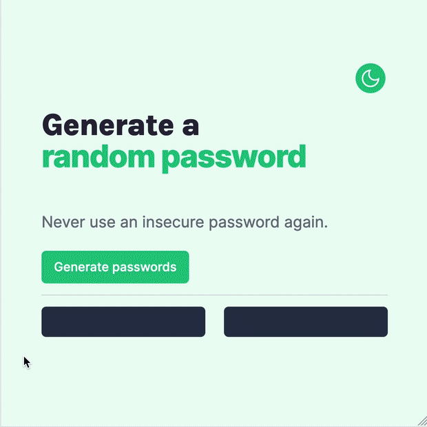

# Solo Project: Password Generator

This is the Password Generator project in the Scrimba Frontend Developer Career Path.

## Table of contents

-   [Overview](#overview)
    -   [The challenge](#the-challenge)
    -   [Stretch Goals](#stretch-goals)
    -   [Screenshot](#screenshot)
    -   [Links](#links)
-   [My process](#my-process)
    -   [Built with](#built-with)
    -   [What I learned](#what-i-learned)
    -   [Continued development](#continued-development)
    -   [Useful resources](#useful-resources)
-   [Author](#author)

## Overview

### The challenge

The challenge was to create a Password Generator app using a Figma design. When the user clicks on the _Generate passwords_ button, the app generates two 15 characters long passwords and shows them to the user.

### Stretch Goals

I went beyond the project scope and created a copy password functionality and light and dark themes. To do that, I had to change the design a little, showing a message when the user copied the password and a _theme-switcher_ button.

### Screenshot

### Links

-   Solution URL: <https://github.com/gdsimoes/scrimba-password/>
-   Live Site URL: <https://gdsimoes.github.io/scrimba-password/>

## My process

### Built with

-   Figma
-   Semantic HTML5 markup
-   CSS custom properties
-   Media Queries
-   JavaScript

### What I learned

My first challenge was learning how to create web pages with light and dark modes and how to use the operating system appearance settings. For example, on my computer, this app will use light mode during the day and automatically change to dark mode at night.

I also learned how to copy text to the clipboard using `navigator.clipboard`, and use Google's Material Symbols. This project was a fantastic opportunity to practice using JavaScript to manipulate the `DOM`. Event handling was tricky, and my app wasn't working until I used `event.currentTarget` instead of `event.target`.

### Continued development

Since the user could change between light and dark modes using both the system settings and clicking on a button, I had to repeat a lot of CSS code. I could be more succinct if I used a CSS preprocessor like [Sass](https://sass-lang.com/). But this project was already taking too long, so I kept it like that.

### Useful resources

-   [CSS Tricks - A Complete Guide to Dark Mode on the Web](https://css-tricks.com/a-complete-guide-to-dark-mode-on-the-web/) - This guide contained everything I needed to implement light and dark modes on this app.
-   [Google Fonts - Material Symbols and Icons](https://fonts.google.com/icons) - Easy to use, beautiful and customizable icons from Google. What more could a web developer ask for?
-   [W3 Schools - Copy Text to Clipboard](https://www.w3schools.com/howto/howto_js_copy_clipboard.asp) - I am not a huge fan of W3 Schools, but this was the most straightforward tutorial I could find on how to copy text to the clipboard.

## Author

-   Website - <https://gdsimoes.com>
-   LinkedIn - [Guilherme Dias Simoes](https://www.linkedin.com/in/gdsimoes)
